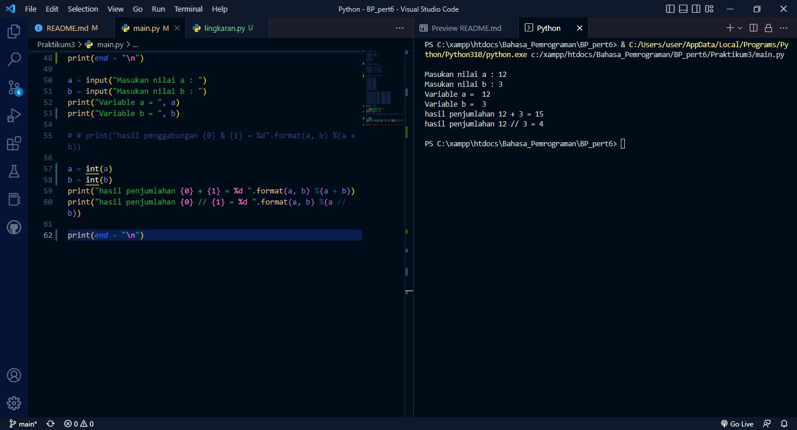

| # | Biodata |
| -------- | --- |
| **Nama** | M. Hannata Zahri |
| **NIM** | 312010318 |
| **Kelas** | TI.20.A.2 |
| **Mata Kuliah** | Bahasa Pemrograman |


## **Latihan 1**
### Penggunaan "end"


### Penggunaan "separator"


### Penggunaan "string format"


## **Latihan 2**
### cara konversi nilai variable



## **Latihan 3**
### membuat gambar ketupat dengan "format string"


## **Tugas Latihan**
### membuat kode program untuk menghitung keliling dan luas lingkaran.


### Berikut source code-nya :

```python
print("\n")

pi_lingkaran = 3.14
jari_jari = float(input("Masukan jari-jari = "))

print("\n")

hitung_keliling = 2 * pi_lingkaran * jari_jari
hitung_luas = pi_lingkaran * jari_jari ** 2

print("Keliling lingkaran dengan jari-jari ({0}) = ".format (jari_jari), hitung_keliling)
print("Luas lingkaran dengan jari-jari ({0}) = ".format (jari_jari), hitung_luas)

print("\n")
```